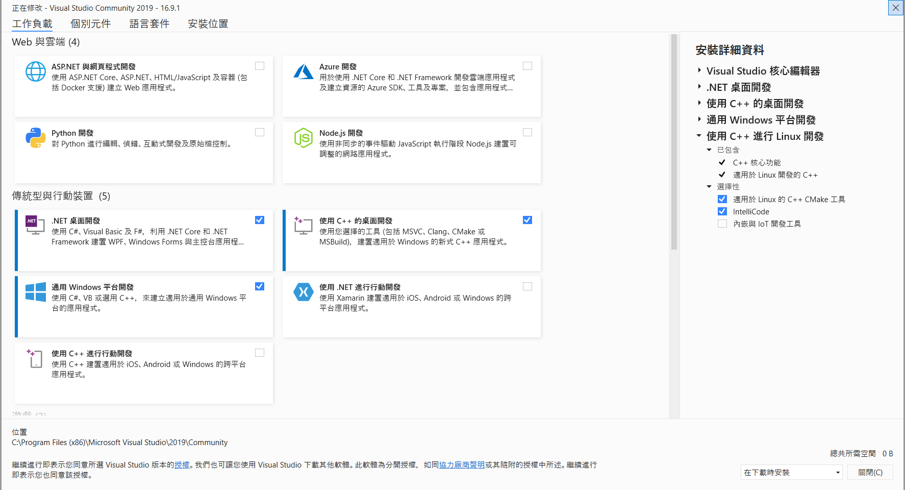
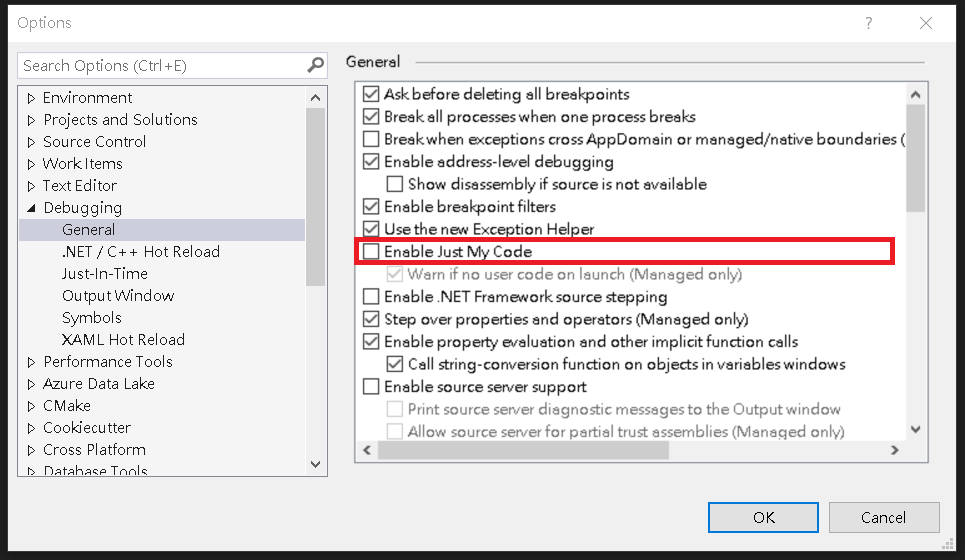

# BBox API Documentation

Sample Code version : v1.2.1

API Version: v3.1.2.2

Release date: Oct., 2021

Download Link : [Link](https://github.com/tmytek/bbox-api/releases/tag/v1.2.1)

## Introduction

BBox API helps developers building their own applications. The release format is DLL and currently only support Windows operating system. The tested environment is Visual Studio community 2019 and LabView 2019.

Every model has its own sample code. Please refer to the sample code inside each folder for different programming language.

# Prerequisites : Network settings

Check network connection : Open TMXLAB Kit to make sure device can be connected

## Prerequisites : Python

Python version  : python-3.7.7 32-bit : [Link](https://www.python.org/downloads/release/python-377/)

External modules can be install with Setup.bat in pre-install/
You also could install pythonnet by launching <pre><code>pre-install\Setup.bat</code></pre> 
    

## Prerequisites : Visual C++ and Visual C#

Step 1 :

Visual Studio version : 2019 community :  [Link](https://visualstudio.microsoft.com/zh-hant/downloads/)

Step 2 : Select targets : Install and Update 

Step 3 : Disable Visual_studio just my code : [Ref_Link](https://docs.microsoft.com/zh-tw/visualstudio/debugger/just-my-code?view=vs-2019)

Final Step : Run sample code : [File_Link](https://github.com/tmytek/bbox-api/blob/master/example/BBoxLite/second_generation/Python/BBOXLITE_DEMO.py)

    $ python BBOXLITE_DEMO.py

    DEMO1 : Switch TX mode

    DEMO2 : Off channel 1 power

    DEMO3 : Channel Gain/Phase control

    DEMO4 : Beam Steering control

## Documentation

### Python 

[BBoxOne Document](https://github.com/tmytek/bbox-api/tree/master/example/BBoxOne%20Series/BBoxOne/Python)

[BBoxLite Document](https://github.com/tmytek/bbox-api/tree/master/example/BBoxLite%20Series/BBoxLite%205G/Python)

### C++

[BBoxOne Document](https://github.com/tmytek/bbox-api/tree/master/example/BBoxOne%20Series/BBoxOne/C%2B%2B)

[BBoxLite Document](https://github.com/tmytek/bbox-api/tree/master/example/BBoxLite%20Series/BBoxLite%205G/C%2B%2B)

### C#

[BBoxOne Document](https://github.com/tmytek/bbox-api/tree/master/example/BBoxOne%20Series/BBoxOne/C%23)

[BBoxLite Document](https://github.com/tmytek/bbox-api/tree/master/example/BBoxLite%20Series/BBoxLite%205G/C%23)

### Labview

[BBoxOne Document](https://github.com/tmytek/bbox-api/tree/master/example/BBoxOne%20Series/BBoxOne/LabView2019)

[BBoxLite Document](https://github.com/tmytek/bbox-api/tree/master/example/BBoxLite%20Series/BBoxLite%205G/LabView2017/BBoxLite28A)

----------
# Paramters

### ScanningDevice
    public string[] ScanningDevice(DEV_SCAN_MODE scanMode)
| Type | Name | Value |
| - | - | - |
| DEV_SCAN_MODE | scanMode | Normal : 0, Fast : 1 |

----------
### Init
    public String Init(sn, dev_type, idx);
| Type | Name | Value |
| - | - | - |
| String     | sn         | Serial Numnber from scan result |
| int     | dev_type         | Type from scan result |
| int     | idx         | Index in scan result |

----------
### setBeamXY
    public string setBeamXY(double db, double angleX, double angleY, String sn);
| Type  | Name  | Value |
| -     | -     | -     |
| double       | db          | gain value
| double       | angleX      | angle value in x direction
| double       | angleY      | angle value in y direction
| String       | sn          | device serial number

----------
### setChannelGainPhase
    public string setChannelGainPhase(int board, int ch, double db, int phase, string sn);
| Type  | Name  | Value |
| -     | -     | -     |
| int       | board       | Board number   : 1-4
| int       | ch          | Channel number : 1-4
| double    | db          | Target db
| int       | phase       | Target deg
| String    | sn          | device serial number

----------
### switchChannelPower
    public string switchChannelPower(int board, int ch, int sw, string sn);
| Type  | Name  | Value |
| -     | -     | -     |
| int       | board       | Board number   : 1-4
| int       | ch          | Channel number : 1-4
| int       | sw          | switch value   : ON 0 , OFF 1
| String    | sn          | device serial number

----------